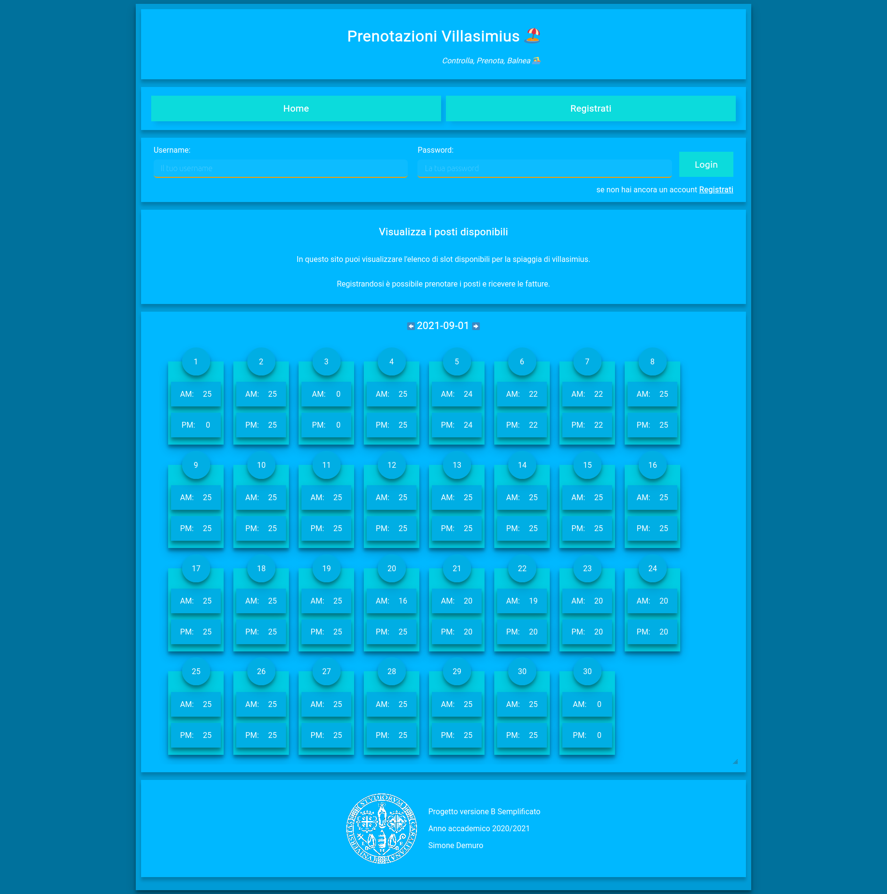

# Progetto Balneare 

# 

# progettazione e convenzioni

Tutte le date sono gestite con lo standard ISO8601. Questa scelta viene fatta sia per comprensibilità ma soprattutto perché è lo standard che viene utilizzato per il parsing delle date da parte sia di java che del database e anche degli input di tipo data di html5.

# Database

La struttura del database prevede le relazioni utente, invoice, reservation, available_slot ed una vista view_user_tot_slot. 

Tutte le relazioni hanno come chiave primaria un id di tipo **serial**. La tabella user ha inoltre un vincolo **unique** sullo username che funziona anche da indice per il metodo getUserByUsername, lo stesso vincolo è stato messo sulla tabella degli slot disponibili sulla coppia data day_part. È inoltre presente un **check** constraint sulla colonna day_part perché questa ammetta i soli valori “AM” e “PM”, sebbene sarebbe stato sufficiente un campo bit o booleano per adempiere il compito si è reputato essere più parlante un varchar(2).

 L’ utente è in relazione 1:n con fatture e prenotazioni. Queste ultime 2 tabelle condividono buona parte dei loro attributi, motivo per il quale è stata presa in considerazione l’opzione di generalizzare gli attributi comuni e far ereditare invoice e reservation da questa relazione, tuttavia dalla analisi dei requisiti si vede come nel momento della processazione da parte dell’utente amministratore di una prenotazione questa diventi, in base al campo invoice opt-in, o una fattura oppure venga semplicemente cancellata la riga facendo venire a meno questa esigenza.

La vista view_user_tot_slot viene utilizzata per semplificare la query usata lato codice con jdbc, in particolare contiene una join tra prenotazioni fattura e utente per permettere dalle prime due di ottenere il numero totale di slot prenotati come somma di quelli processati e non, **fatta eccezione** di quelli che per motivi di privacy l’utente ha deciso che non si voglia che ne venga tenuta traccia deselezionando il campo per la fattura. 

# il backend

L’applicazione è Java EE **“pura”**, nel senso che fa uso del pattern MVC ma senza l’utilizzo di framework come Spring né di un ORM per accesso al db e creazione entità. Le **dipendenze** sono limitate a json-taglib ed il connettore a postgresql. 

Nel momento del **login**, a seguito della verifica delle credenziali fornite vengono caricati in sessione i parametri che vengono regolarmente controllati sia nelle servlet che nelle pagine jsp per visualizzare i contenuti appropriati all’utente impersonato e parametri impostati. Ad esempio, nel momento in cui si è loggati scomparirà la sezione che consente la registrazione di un nuovo utente e analogamente un utente semplice non sarà in grado di visualizzare la dashboard dell’admin nemmeno entrando con l’indirizzo o artefacendo una chiamata Ajax. Infatti, ogni funzionalità implementata è **role based**, per questa ragione viene effettuato il controllo sulle jsp che nei metodi delle servlet sulle varie funzioni del sito.

La **registrazione** di un utente prevede un form, una validazione dei dati immessi e l’inserimento di questi nel db. L’**area personale** funziona in modo analogo effettuando un pre-popolamento dei dati nei campi da modificare, ma solo nel momento in cui ci si clicca sopra e in seguito un update nella tabella utente anzi che una insert. Per evitare di modificare tutti i campi ogni modifica fatta, vengono inviati con ajax solo quelli modificati previo controllo con Jquery, la query viene poi creata dinamicamente come stringa in base ai campi passati ma si fa comunque uso di jdbc per settare i valori al loro interno per migliorare la sicurezza.

Gli **slot** sono un’entità determinata da data e momento del giorno (am o pm). L’**assenza di uno slot** è da considerarsi come assenza di posti disponibili. È volutamente possibile lasciare uno slot vuoto all’interno del database, questo implica però che: se si **aggiunge** uno slot si deve prima controllare che esista o meno, in caso affermativo sommare i posti e in caso negativo crearne uno nuovo, per la visualizzazione e prenotazione degli slot è necessario dare continuità ai dati, ovvero fare in modo che non vi siano “buchi” nei range temporali di interesse. Per questo motivo le servlet dopo aver estratto i dati dal db provvedono a creare una collezione completa di slot, solitamente all’interno di ArrayList per effettuare comodamente visualizzazione o prenotazione.

La **prenotazione** degli slot consente in un certo lasso temporale di scegliere un numero arbitrario di posti che verranno sottratti a quelli disponibili e la creazione di una prenotazione che l’amministratore dovrà processare. Si è prestato attenzione affinché la query che effettua l’update dei posti disponibili risultasse essere quanto più atomica possibile (transazione implicita di postgresql), in modo che non possa succedere che se uno degli update non andasse a buon fine venissero invece sottratti posti in altri slot. Vengono impediti sia a front end che a backend l’inserimento di valori negativi. 

La **visualizzazione delle fatture** lato servlet è una estrazione e mapping su un modello dei dati delle fatture per poi essere mostrati come sono nel front end in una tabella.

La **visualizzazione degli utenti** è una funzione la cui “complessità” è stata demandata al database per la sua eccelsa capacità di lavorare su set di dati, la query sulla vista accetta come parametri l’ordinamento che viene passato in base alla colonna selezionata sul front end.

 

# Il front end 

Il front end dell’applicazione è puro html, css, e javascript con Jquery. In aggiunta jstl per renderizzare programmaticamente alcune componenti html server side.

La bozza iniziale del sito è stata fatta su carta, successivamente realizzata con “grossi quadratoni” in html e in un secondo momento convertita in jsp e resa funzionale. Si è scelto di creare un **layout** molto semplice di dimensione fissa e centrato ma responsive con **media query**. 

Il sito utilizza il font non serif di google Roboto, importato come woff da css, con caratteri bianchi su sfondo celeste.

Sono state utilizzate emojii, esse sono infatti belle, chiare e facili da inserire e sono supportate su tutti i browser ad eccezione di chrome ma solo sulle versioni di windows precedenti al 10.

Il sito rispetta una precisa **palette** **di** **colori**, con varie tonalità di blu di intensità differenti, ed un arancione che complementare al blu da un forte contrasto per evidenziare gli elementi importanti quali i campi di testo e input in generale. Agli elementi del sito quali sezioni, pulsanti e calendario viene conferita un’ombreggiatura tipica nel design material viene usata per dare il senso della **profondità**. **Passando sopra** gli elementi interattivi si otterrà l’effetto che questi si ingrandiscano e/o cambino accento nella loro colorazione, solitamente cambiando il loro canale alpha dando il senso di “passare effettivamente sopra qualcosa di tangibile”.

Le varie **sezioni** del sito sono realizzate come dei rettangoli ben separati tra loro, rendendo il loro utilizzo intuitivo e riutilizzabile nelle varie pagine del sito.

Le varie sezioni che si occupano di visualizzare i dati dal backend dell’applicazione quali: visualizzazione calendario, area personale, gestione fatture, inserimento slot, conferma prenotazioni, gestione utente, al document ready effettuano una chiamata Ajax alla servlet che restituisce parte della DOM, solitamente le righe della tabella o un intero div che poi viene “attaccato” DOM alla pagina con Jquey. Gli update delle pagine sono gestiti allo stesso modo previa eliminazione e reinserimento degli elementi della DOM. 

# informazioni

Il progetto è stato sviluppato sulla VM ubuntu fornita nel corso, versionato con git usando come remote github. Il front end è stato sviluppato con IntelliJ Idea, il backend con netbeans e per la gestione del database pg admin e IntelliJ Datagrip.

Per testare le funzionalità del sito sono stati inseriti alcuni dati di mock importabili nel backup “ExamFPW\DB\ BalneareDB_Backup.sql”, in particolare vi sono slot pre-popolati su Settembre e Ottobre.

Gli utenti che possono essere usati per testare sono i seguenti:

| Username | Password | Fattura |
| -------- | -------- | ------- |
| demuro   | 65879    | no      |
| user1    | user     | si      |
| user2    | user     | si      |
| user3    | user     | no      |

 

## Requisiti:

- [x] Prenotazione Posti

- [x] Archiviazione Fatture

- [x] Gestione Utenti

  - [x] Semplice:

    - [x] Registrazione 

      **username** (che deve essere univoco)  **password**, e caricando tutti i suoi dati anagrafici. In particolare, ogni utente deve caricare: **nome**, **cognome**, **data di nascita**, **codice fiscale**, **sesso**, **e-mail**, **numero di cellulare** e un parametro che indica se l’utente desidera **ricevere la fattura OPT-IN**  elettronica o meno.

    - [x] Pagina personale modifica anagrafica

    - [x] Prenotazione posti in slot (1.)

    - [x] Visualizzazione estremi fatture

  - [x] Amministratore

    ​	L'amministratore viene creato manualmente, è solo 1

    - [x] Inserire nuovi slot *inserendo data, slot, numero posti*
    - [x] salvataggio estremi fatture emesse:
      - [x] Anche se il pagamento del servizio e la creazione della eventuale fattura avvengono con software esterni e indipendenti dall'applicazione web corrente, l’amministratore salva nell’applicazione web gli estremi delle fatture emesse per i clienti che la richiedono. Precisamente, l’amministratore può salvare nell’applicazione i dati delle fatture emesse ai clienti che hanno prenotato lo stabilimento. In particolare, l’amministratore analizza una ad una le prenotazioni passate non ancora processate e può decidere di aggiungere i dati della fattura originale nell’applicazione web (ma solo se l’utente che ha effettuato la prenotazione ha indicato, nello specifico campo del suo profilo personale, che è interessato a ricevere la fattura elettronica). I dati della fattura che vengono salvati sono l’identificativo, il prezzo totale, la data, il numero di posti prenotati e una descrizione del servizio offerto in formato testuale.  (3.)
    - [x] Schermata visualizzazione:
      - [x] Tutti utenti con i loro dati e numero di prenotazioni effettuate
      - [x] Elenco di utenti e totale posti prenotati nel tempo con menu per ordinare asc o desc per cognome o numero di posti prenotati nel tempo

  - [x] Guest

    - [x] Visualizzazione Slot prenotabili e numero posti in ogni slot

---

1. Due slot al giorno: **mattina** 8:00 - 14:00 **pomeriggio** 14:00 - 20:00. 

2. NB: ogni slot è prenotabile se è disponibile un numero di posti liberi sufficiente a prenotare tutti i posti che l’utente richiede.

3. NB: L’emissione della fattura è legata alla sola prenotazione, quindi i clienti ricevono i dati della fattura anche se non hanno ancora utilizzato il servizio (perché magari hanno prenotato oggi per una data futura). Inoltre, ad ogni prenotazione corrisponde una sola fattura: l’utente che prenota per la sua famiglia di quattro persone vedrà i dati di un’unica fattura e non quattro.

   Per comprendere meglio questa feature si consideri il seguente esempio.

   Il giorno 15/06/2021 gli utenti semplici Mario e Dino prenotano entrambi l’utilizzo dello stabilimento per due differenti date future. Mario, nel suo profilo personale, ha impostato il campo che indica che è interessato a ricevere la fattura elettronica. Dino invece no. Entrambe le prenotazioni vengono confermate dal sistema. L'amministratore, in una data successiva al 15/06/2021 processa tutte le prenotazioni del 15/06/2021. Sia la prenotazione di Mario che quella di Dino vengono rimosse dall’elenco delle prenotazioni. La prenotazione di Mario viene inserita tra le fatture emesse, con i relativi dati, mentre quella di Dino non viene inserita da nessuna parte (è stata quindi semplicemente rimossa dall’elenco delle prenotazioni).
